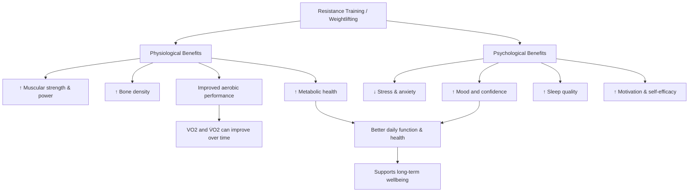

<h1 align="center">Benefits of Weightlifting</h1>

## Table of contents

- [Introduction](#introduction)
- [Scientific Notation](#scientific-notation)
- [Weightlifting Benefits Flowcart](#weightlifting-benefits-flowcart)
- [Link](#link)
## Image
<table>
  <tr>
    <td>
      
    </td>
    <td>
      Weightlifting isnt only benefical for wanting to look good, but it is also food for a bunch of physiological and psychological benefits!
    </td>
  </tr>
</table>
 
## Benefits relating to VO2 

Regular resistance training improves muscular strength and movement efficiency, which reduces the energy cost of exercise and supports higher oxygen utilization. Over time, these adaptations can contribute to increases in  V̇O₂

## Weightlifting Benefits Flowchart

## Link
    
[Currently learning Github! Go to my other file i've done in an earlier class](./assignment.md)

