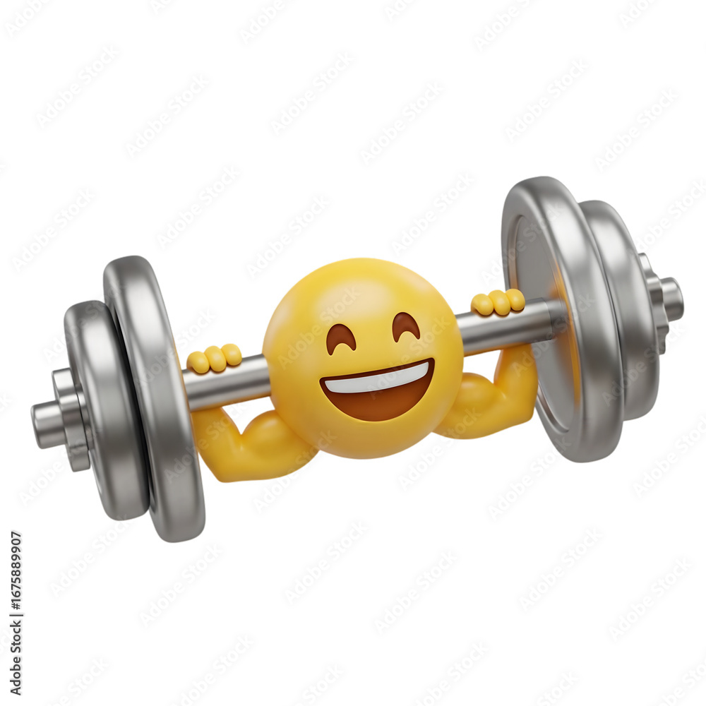
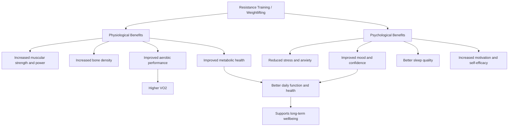

<h1 align="center">Benefits of Weightlifting</h1>

## Table of Contents

- [Introduction](#introduction)
- [VO2 Benefits](#VO2-benefits)
- [Weightlifting Benefits Flowchart](#weightlifting-benefits-flowchart)
- [Link](#link)

## Introduction

<table>
  <tr>
    <td>
      
    </td>
    <td>
      Weightlifting isnt only benefical for wanting to look good, but it is also food for a bunch of physiological and psychological benefits!
    </td>
  </tr>
</table>
 
## VO2 Benefits
 

Weightlifting improves muscle strength and movement efficiency, which reduces the energy cost of exercise and supports higher oxygen utilization. Over time, these adaptations can contribute to increases in V̇O₂

## Weightlifting Benefits Flowchart

## Link
    
[Currently learning Github! Go to my other file i've done in an earlier class](./assignment.md)

