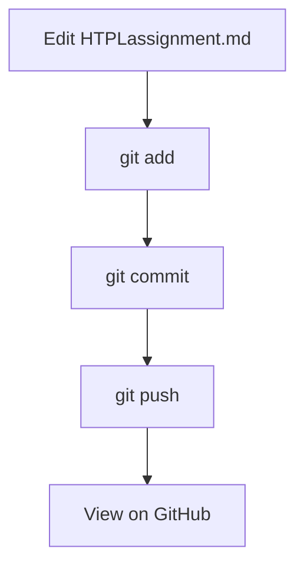

<h1 align="center">HTPL Assignment</h1>

## Table of contents

- [Image](#image)
- [Link](#link)
- [Scientific Notation](#scientific-notation)
- [Mermaid Diagram](#mermaid-diagram)

## Image

<table>
  <tr>
    <td>
      
    </td>
    <td>
      Cool lifting emoji.
    </td>
  </tr>
</table>

## Link

[Go to my other file](./assignment.md)
 
## Scientific Notation

VO2

## Mermaid Diagram

